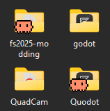

<p align="center">
  
</p>

# Leclaude

Leclaude shows a robot badge in Windows Explorer on each folder that has [Claude Code](https://www.anthropic.com/claude-code) session history.
When you look through your disk, you can immediately see the folders where you did work with Claude Code.

Leclaude is a shell extension for Windows 10 and Windows 11, on x64 and ARM64.

## How it operates

Claude Code records each opened folder in `%USERPROFILE%\.claude\projects\`.
Leclaude registers an icon-overlay handler with Explorer.
For each visible folder, the handler does one fast search in a set in memory.
When the folder has session history, Explorer draws the robot badge on the folder icon.
A watcher thread follows the Claude Code data and refreshes the badges.



The design documents give the full details:

- [The architecture](docs/architecture.md)
- [The Claude Code data format](docs/claude-data-format.md)

## Installation

1. Download the zip file for your processor from the [releases page](../../releases): `x64` or `arm64`.
2. Make sure that the file is authentic (optional, see below).
3. Unpack the zip file.
4. Open an administrator PowerShell in the unpacked folder.
5. Enter: `.\install.ps1`

The script copies the DLL to `%ProgramFiles%\Leclaude`, registers the handler, and restarts Explorer.

To remove Leclaude, enter: `.\uninstall.ps1`

### Make sure that a release is authentic

The release workflow attests each zip file with [GitHub artifact attestation](https://docs.github.com/en/actions/security-for-github-actions/using-artifact-attestations).
Sigstore signs the attestation. To do a check, enter:

```
gh attestation verify Leclaude-<tag>-x64.zip --owner robinduckett
```

The command shows the workflow and the commit that made the file.

## Compilation from the source

The build uses CMake with the Ninja generator. Visual Studio contains both tools.

1. Open a Developer PowerShell for Visual Studio.
2. Enter: `cmake --preset x64-release`
3. Enter: `cmake --build --preset x64-release`
4. To do the tests, enter: `ctest --test-dir build/x64-release --output-on-failure`

## Limits

- The installation needs administrator rights. Windows accepts overlay registrations in HKLM only.
- Windows shows a maximum of 15 overlay types for the full system. Cloud-storage tools use many of them. When too many tools compete, Windows can ignore the Leclaude badge. The [ShellExView](https://www.nirsoft.net/utils/shexview.html) tool shows the competition on your system.
- In a cloud sync folder (for example, a OneDrive folder), Windows 11 can hide third-party badges.

## Problems and solutions

The badge shows an old icon after an update, but only at some sizes:
Explorer keeps the icons in cache files on the disk, with one file for each size.
An Explorer restart does not delete these files. To delete them, enter these commands in PowerShell:

```powershell
Stop-Process -Name explorer -Force
Remove-Item "$env:LOCALAPPDATA\Microsoft\Windows\Explorer\iconcache_*.db" -Force -ErrorAction SilentlyContinue
if (-not (Get-Process explorer -ErrorAction SilentlyContinue)) { Start-Process explorer.exe }
```

A restart of the computer also corrects this.

The badge does not show at all:
Windows shows a maximum of 15 overlay types. Use the ShellExView tool to see the loaded handlers.
Make sure that the name " Leclaude" is in the first 15 names under the registry key `ShellIconOverlayIdentifiers`.

## Documentation language

All the text in this repository obeys [ASD-STE100](https://www.asd-ste100.org/) (Simplified Technical English), Issue 9.
STE is the international standard for clear technical documentation.
This project uses it as an experiment in readable open-source documentation.

## License

MIT. See [LICENSE](LICENSE).
